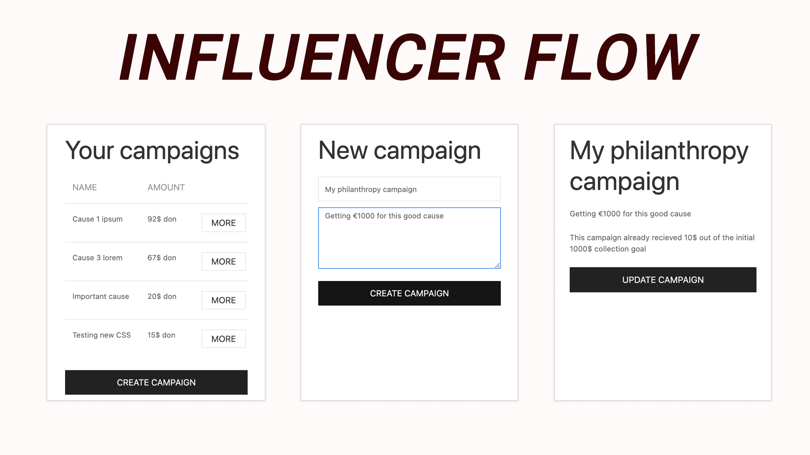

# Monetizing Philanthropy: browser extension [WIP]

## About
With more platforms adopting own monetization models, the dangers of platforms monopolizing advertising infrastructure and creator revenue increase exponentially. This research project aims to create and test a more transparent system for spontaneous microtransactions between creators and audiences, based on insights from both groups. [Read more](https://community.webmonetization.org/philanthropy/monetizing-philanthropy-on-social-media-1i0i).

[Monetizing Philanthropy](https://community.webmonetization.org/philanthropy/monetizing-philanthropy-on-social-media-1i0i) is an a joint interdisciplinary project from [Maastricht Law & Tech Lab](https://github.com/maastrichtlawtech), [Maastricht University Institute of Data Science](https://github.com/MaastrichtU-IDS), and the [Department of Computer Science](https://github.com/university-of-york) from the University of York.

## Develop
### Install and develop
To first load the extension in the Chrome browser, 

- Clone this project: `git clone https://github.com/maastrichtlawtech/webmon-extension`
- In Chrome click on the options menu (the three dots on top-right)
- Click on _More tools > Extensions_ options
- Enable _Developer mode_
- Click on _Load Unpacked_
- Select the directory of this project `webmon-extension`

If you make changes to the extension's codebase, you need to **update** it in order to see them:
- Go to the _Extensions_ menu again
- Find the extension _Web Monetization extension_
- Reload by pressing the circular arrow next to the name
- Changes will be show

### Structure
The browser extension is structured as it follows:
- **`injectbutton.js`**: the script injecting the _donate_ button on the Youtube page and allows donors to interact with the campaign created by the video's uploader
- `popup`: the code that enables the browser popup screen
    - **`popup.js` `popup.html`**: the script generating the right screens that are shown on the popup screen. the styling of these screens use **`uikit.min.css`**. see [getuikit.com](https://getuikit.com/)
    - `utils`: the helpers and interactions for the popup screen
        - **`api.js`**: the script that connects the backend API with the interactions within the popup screen. the methods are used in `popup.js` like `api.getUserDonations()`
        - **`screens.js`**: the script that generates and injects the right screen onto the root of the popup screen based on input from the API. it is used in `popup.js` like `screens.createInfluencerScreen(data)`
- **`manifest.json`**: the configuration file for the browser extension

## Resources
- **Monetizing Philanthropy Repositories**
    - LUCE & Users API: https://github.com/maastrichtlawtech/webmon-LUCE-API 
    - LUCE Docker Image: https://github.com/vjaiman/LUCE
    - LUCE Interledger Integrations: https://github.com/alfa-yohannis/LUCE/tree/master/interledger
- **Monetizing Philanthropy Articles**
    - [Monetizing philanthropy on social media](https://community.webmonetization.org/philanthropy/monetizing-philanthropy-on-social-media-1i0i)
    - [Monetizing philanthropy: First findings](https://community.webmonetization.org/philanthropy/monetizing-philanthropy-first-findings-3m4b)
    - [Ludwig’s subathon - when an idea snowballs unexpectedly](https://community.webmonetization.org/philanthropy/ludwig-s-subathon-when-an-idea-snowballs-unexpectedly-34pp)
    - [Clout chasing on social media: The role of controversy in content monetization](https://community.webmonetization.org/philanthropy/clout-chasing-on-social-media-the-role-of-controversy-in-content-monetization-4dkg)